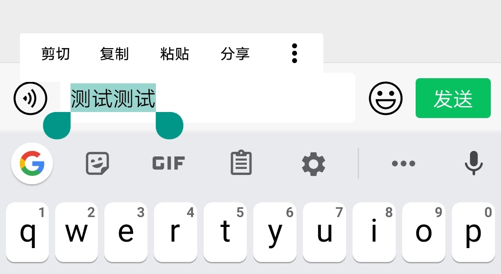
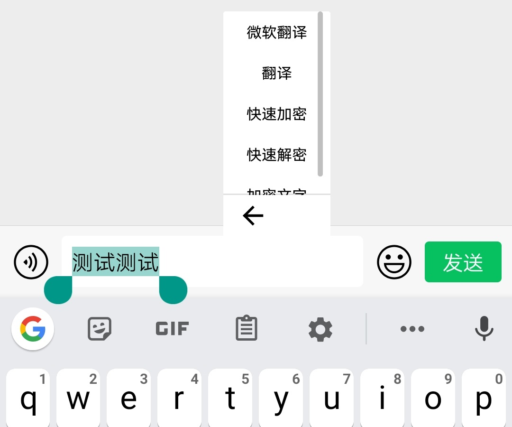
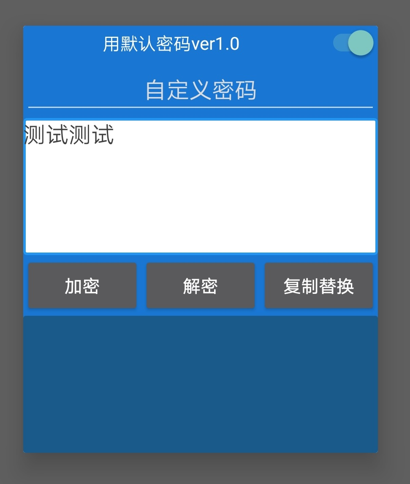

# EncryptText App for Android
A simple application to encrypt text. Can be used in combination with many other applications, to increase security and privacy.

# Usage
The application can be opened just as any other application. However, to avoid
the tedious application switching, the encryption can happen in-place, in any 
application.

首先选择你想要加密的文字:

你可以选择快速加密，也可以点击Encrypt Text来输入一个自定义密码

**ENCRYPT**:

加密后的文字会显示在下面的文本框内（点击即可复制）。 点击 **复制替换** 就可以关闭App并且复制

由于微信屏蔽了所有的对它App内部的替换，唯一可以做的就是再粘贴一遍。

有兴趣的可以关注https://t.me/KeepAssSafe
